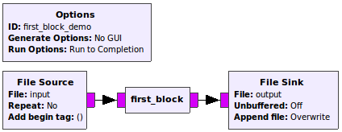
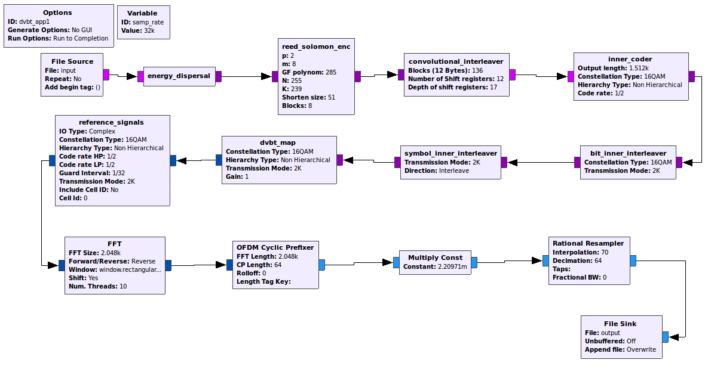

# Context

I'm attempting to do a bit of fuzz testing of GNURadio with afl.

Since GNURadio is more of a platform for building SDR applications I've focused on a particular setup: a SDR system that sends / receives DVB-T (digital video broadcast - terrestrial) using a USRP device. Hence some fuzz testing harnesses require installing `UHD` by EttusResearch and `gr-dvbt` by BogdanDIA. 

GNURadio is written in C++ and Python. In general, module functionality is written in C++ and compiled to shared libraries. GNURadio applications are written in Python and link to the libraries via a SWIG interface. Unfortunately, afl can't be used to instrument Python scripts, so this repo contains a few simple GNURadio applications written in C++ that *can* be instrumented.

# Setup

### Build afl-fuzz

```
git clone https://github.com/mirrorer/afl
cd afl
make
```

### Install GNURadio

GNURadio needs to be compiled with afl `instrumentation`, and so must be built from source:

```
git clone https://github.com/gnuradio/gnuradio.git
cd gnuradio
mkdir build
cd build
CC=/path/to/afl-gcc CXX=/path/to/afl-g++ cmake -DENABLE_DOXYGEN=OFF -DCMAKE_BUILD_TYPE=Debug ../
make && make test
sudo make install
```

See `https://wiki.gnuradio.org/index.php/BuildGuide` for more detailed instructions.

### Install gr-dvbt

Optional, but some fuzz test harness are testing 

```
git clone https://github.com/BogdanDIA/gr-dvbt.git
cd gr-dvbt
mkdir build
cd build
CC=/path/to/afl-gcc CXX=/path/to/afl-g++ cmake -DCMAKE_BUILD_TYPE=Debug ../
make
sudo make install
sudo ldconfig
```

### Install this module

```
git clone https://github.com/liampingu/gr-fuzzing
cd gr-fuzzing
mkdir build
cd build
CC=/path/to/afl-gcc CXX=/path/to/afl-g++ cmake -DCMAKE_BUILD_TYPE=Debug ../
make
sudo make install # to install the tester blocks
```

# Fuzzing

### Tester blocks

This module contains two blocks, both implemented in C++, that can be used to test that fuzzing is working. `first_block` copies it's input to it's output, whereas `second_block` does the same but SEGFAULTS if the input contains a `\0` byte. 

There is both a python script and C++ program that make use of each of the tester blocks, as well as `.grc` flowgraph file. However only the C++ programs (`examples/c++`) can be used as fuzz test harnesses.



For repo root: 
```
/path/to/afl-fuzz -m 100 -i test_cases/demo_blocks/ -o results/fuzz-test1 -- build/examples/c++/first_block_demo @@ /dev/null

/path/to/afl-fuzz -m 100 -i test_cases/demo_blocks/ -o results/fuzz-test2 -- build/examples/c++/second_block_demo @@ /dev/null
```

### DVB-T app

The DVB-T app is based on a GRC flowgraph provided with BogdanDIA's `gr-dvbt` module (the exact file is `apps/dvbt_tx_demo.grc`). The simplified flowgraph (and the python script GRC converts it to) are included for reference at `grc/dvbt_app*`. `examples/c++/dvbt_app*.cc` is the C++ implementation based off the python script, it can be used as a test harness for fuzzing. 

Note: for the `rational_resampler_xxx_0` block, the `taps` argument is left as `None` in the python script, indicating automatic filter taps should be used. In the C++ implementation this is not possible, so I assiged it some fairly arbitary taps.



```
/path/to/afl-fuzz -m 100 -i test_cases/dvbt_app/ -o results/fuzz-test3 -- build/examples/c++/dvbt_app1 @@ /dev/null
```

# Results

See `results/` directory...

`fuzz-test1`: 
- test harness: `first_block_demo`
- 100k+ execs
- 134 paths found
- no crashes or hangs

`fuzz-test2`:
- test harness: `second_block_demo` (segfaults on `\0` byte)
- 100k+ execs
- 120 paths found
- 43 crashes found

`fuzz-test3`:
- test harness: `dvbt_app1`
- 8.8M execs
- 2700 paths found
- no crashes, 3 unique hangs
